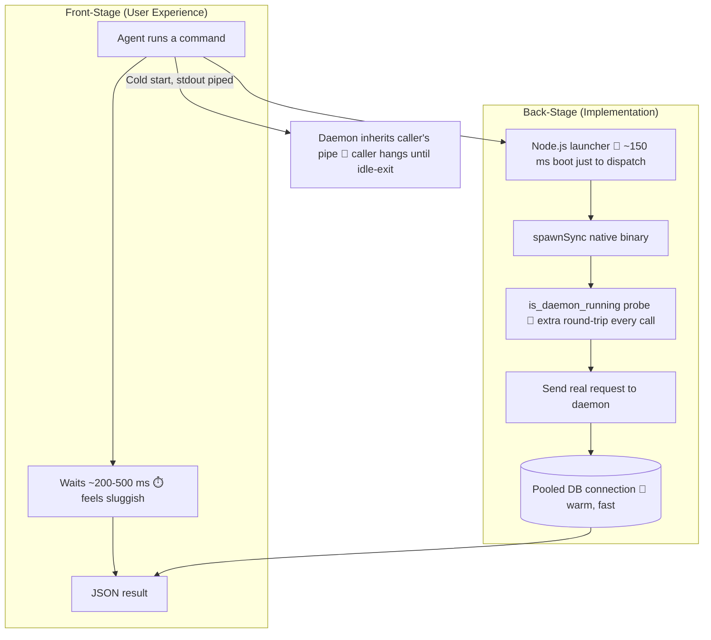
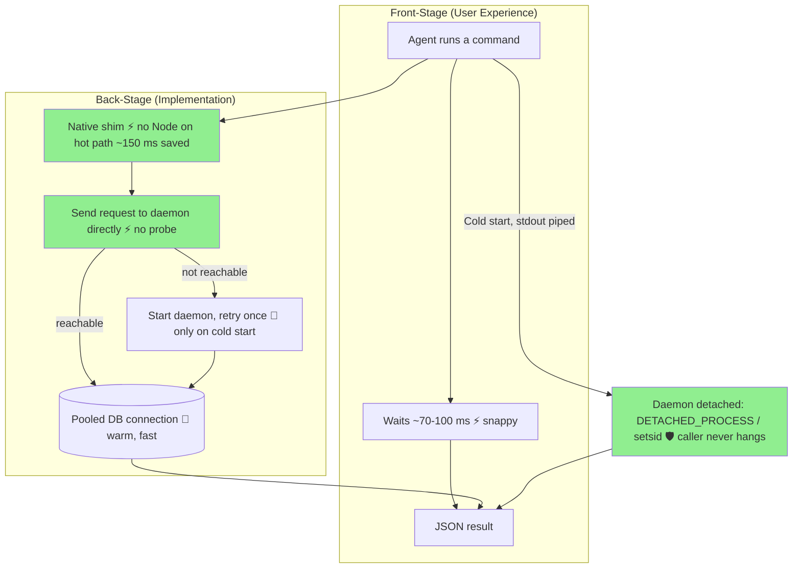

# CLI Launch Latency: Before / After

**Type:** Refactoring (Before/After) Flow Diagram
**Last Updated:** 2026-06-01
**Related Files:**
- `bin/agent-database-cli.js` (Node launcher — kept as fallback)
- `bin/postinstall.js` (rewrites launcher shims to call the native binary directly)
- `rust/src/runtime.rs` (`run_via_daemon` — removed per-call daemon probe)
- `rust/src/daemon/control.rs` (`detach_command` — daemon no longer holds caller's stdio)
- `scripts/bench-launch.ps1` (latency + correctness gate)

## Purpose

An AI agent issues many short database commands in a row, so every millisecond of
per-command startup is felt as sluggishness. This change makes each command return
roughly 3x faster and removes a cold-start hang that could freeze an agent's pipeline.

## Diagram

### Before — every command pays Node startup + a redundant probe

### After — native launch, single round-trip, clean detach

## Key Insights

- **Snappier agents (⚡):** Removing Node from the launch path saves ~150 ms per call; the
  warm path also drops a redundant daemon probe (one round-trip instead of two).
- **No more freezes (🛡️/🔄):** Detaching the spawned daemon means a piped caller
  (`out=$(agent-database-cli ...)`) gets EOF immediately on a cold start instead of hanging
  until the daemon idle-exits.
- **Safe fallback (🔄):** The Node launcher remains the linked `bin`, so `--ignore-scripts`
  installs and unusual layouts still work — just at the original speed.
- **Technical enabler:** Connection pooling in the daemon already made the DB round-trip
  cheap; this change removes the *process and protocol* overhead that was dominating it.

## Change History

- **2026-06-01:** Initial creation — documents the launch-latency optimization
  (Node-free shim, single round-trip, daemon detach).
